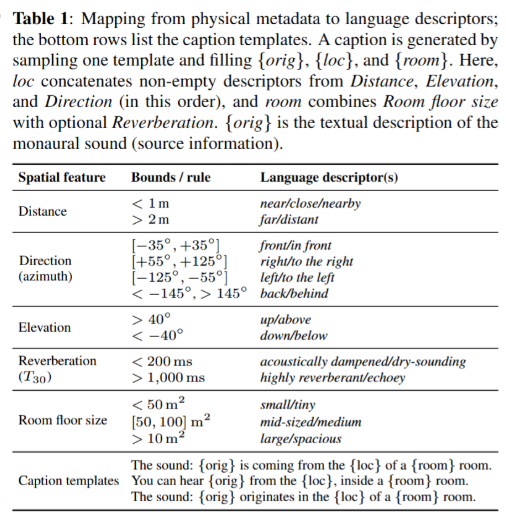

# DISSE:  Learning Disentangled Source And Spatial Representations From Spatial Audio–Text Contrastive Learning
# Notice
This repository is not the official release.  
The content is written in Japanese and is still under development / incomplete.  
A complete and fully maintained version (including the final code and English documentation) will be released publicly in the near future. However, please refer to the **table below ("Mapping from Physical Metadata to Language Descriptors")**,  
as it provides important information not included in the paper.

## Mapping from Physical Metadata to Language Descriptors
This figure shows the **rule set used to convert physical spatial metadata into natural language descriptors** when extending a dataset from **monaural audio with captions** to **4-channel spatial audio with spatialized captions**.  
<p align="center">
  
</p>


---


## 概要

**DELSA** は音–テキストペアから **音源情報（何が鳴っているか）** と **音響空間情報（どこで・どのように鳴っているか）** を明示的に分離して学習するフレームワークです。CLAPベースのHTSAT音声バックボーンと**空間属性ブランチ**を組み合わせ、共有512次元特徴を**空間埋め込み（512次元）** と **音源埋め込み（512次元）** に分岐します。また、空間埋め込みから**物理属性**（方向、距離、部屋面積、残響時間T30）を予測し、分離性を強化します。

---

## 要点

1. **音/テキスト両方の二重ヘッド埋め込み**（空間・音源）と学習可能温度パラメータ
2. **物理量予測による空間表現の監督**（方向、距離、面積、T30）
3. **オンザフライdry×RIR畳み込みデータセット** + FOA変換・強度ベクトル特徴 + キャプション空間拡張
4. **前計算済み検証パイプライン**による固定セットでの評価（再現性向上）
5. **評価指標**: R\@K、Invariance Ratio

---

## リポジトリ構成

```
├── config.yaml
├── train_for_singleGPU.py         # 単一GPU学習 + エポックごとのRetrieval評価
├── train_ddp.py                   # マルチGPU DDP + AMP + 勾配累積
├── dataset/
│   ├── audio_rir_dataset.py       # オンザフライdry×RIR畳み込み + キャプション拡張
│   └── precomputed_val_dataset.py # 前計算済み検証データセット
├── model/
│   ├── delsa_model.py             # DELSAモデル（音声/テキストヘッド、物理ヘッド）
│   ├── shared_audio_encoder.py    # HTSAT + 空間ブランチ → 512次元共有音声表現
│   ├── shared_text_encoder.py     # テキストエンコーダ
│   └── RegressionHead.py          # 物理量回帰ヘッド
└── utils/
    └── metrics.py                 # Retrieval/IR指標
```

---

## 手法概要


**Audio Encoder**

* 音源属性ブランチ: HTSAT（CLAPと同様）出力（768次元）
* 空間属性ブランチ: `I_act` / `I_rea`（強度ベクトル）を6層CNN×2で処理 → MLP → 44次元 → 線形で192次元
* 上記2つの出力を結合（768+192）→ MLP → 512次元Shared_Audio埋め込み
* Shared_Audio埋め込みから**空間埋め込み（256次元）** と **音源埋め込み（512次元）**

**Text Encoder**

* テキストエンコーダ出力（512次元）
* Shared_Text埋め込みを**空間埋め込み（256次元）** と **音源埋め込み（512次元）** に分岐

**物理ヘッド**

* 空間埋め込みから 方向（2）、面積（1）、距離（1）、残響（1）を回帰

**目的関数**

* **教師ありコントラスト学習**（空間/音源）: multi-positive対応. 空間, 音源それぞれに対して計算.
* **物理Loss**: 方向はコサイン類似度損失（ラジアン）、他はMSE。学習時は正規化値、検証時は実スケールに戻す

## 評価指標
上記に加えて以下もvalidation setに対して記録する.
### Retrieval（R\@K; multi-positive）

**何を測るか**: 与えたクエリ（テキストまたは音）の上位K件に、同一ID（タスクに応じて source または space）を持つ要素が少なくとも1つ含まれる割合。

* タスク定義

  * SRC: text\_source ↔ audio\_source（同一 source\_id を正解）
  * SPA: text\_space  ↔ audio\_space（同一 space\_id を正解）
  * オフタスク（漏洩チェック）: X-SRC, X-SPA は「誤った組み合わせの埋め込み」でR\@Kを測り、低いほど望ましい（分離できていれば当たらない）。
      * X-SRC: text\_space ↔ audio\_space（同一 source\_id を正解）
      * X-SPA: text\_source  ↔ audio\_source（同一 space\_id を正解）
* multi-positive: 1つのクエリに複数の正解がありうる（同じIDのアイテムが複数）。R\@Kは「上位K内にいずれかの正解があれば1、なければ0」を平均する。
* 解釈: R\@Kが高いほど、そのタスク（SRC/SPA）の整合性が高い。オフタスクはR\@Kが低いほど情報漏洩が少なく、分離が良好。

### Invariance Ratio（IR）
* **目的**: ある埋め込み空間が、片方の属性に不変で他方に敏感かを、ペアワイズ距離の平均比で評価。
* **集合の定義**:

  * `same-space & diff-source`: 同じ空間IDだが異なる音源IDのペア集合（空間固定で音源が変化）
  * `same-source & diff-space`: 同じ音源IDだが異なる空間IDのペア集合（音源固定で空間が変化）
* **指標**:

  * IR\_space  = 平均距離(same-source & diff-space) / 平均距離(same-space & diff-source)

    * 大きいほどSourceに不変でSpaceに敏感
  * IR\_source = 平均距離(same-space & diff-source) / 平均距離(same-source & diff-space)

    * 大きいほどSpaceに不変でSourceに敏感
---

## データ準備

1. 音（dry）: `{audiocap_id, caption}`列を持つCSVと48kHz・10秒長に揃えたMP3ファイル群
2. RIRメタデータ: `rir_path, azimuth_deg, elevation_deg, source_distance_m, area_m2, fullband_T30_ms`

audio_rir_dataset.pyで2つを畳みこみfoa音　＋　空間キャプション　のペアを生成.

---


---

## 再現性と評価

* 乱数固定（seed=42）、検証は固定データセットで実施
* 評価はR\@K, IR
* W\&Bにログ、自動チェックポイント保存

---

